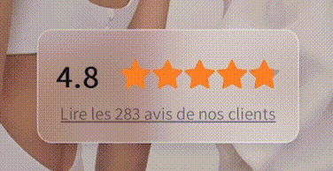

# Glassmorphism Google Reviews Panel

## Description

This tweak adds a modern frosted glass effect to the Google Reviews module on the homepage of [elyacouture.com](https://elyacouture.com). It also ensures better mobile responsiveness by scaling the module down on smaller screens.

## Features

- **Frosted Glass Effect:** Applies a semi-transparent background with a blur to create the frosted glass appearance.
- **Mobile Optimization:** Scales down the module on mobile screens to improve layout and user experience.

## Before / After

### Before

In the original design, the module lacked visual depth and responsiveness. Without the frosted glass effect, the background felt flat, making the content less engaging. Additionally, the module did not scale down for mobile, leading to a cluttered, overwhelming display on smaller screens.

### After

The improved design introduces a frosted glass background with a subtle blur, adding depth and modern aesthetic to the UI. The layout is now mobile-optimized, scaling down on smaller screens to improve usability and fit more seamlessly into the mobile viewport. This makes the module visually appealing and helps it blend in better with the main page.

## Project Structure

- `frosted_google_reviews-pannel/`
  - `frosted_google_reviews-pannel.css`: Contains the CSS for the frosted glass effect and mobile optimization.

## Author

- [Emin A.](https://github.com/emayia): Software Engineering student at École 42 based in Nice, France.

- Webmaster at [elyacouture.com](https://elyacouture.com).

### Addendum
Thanks to [Mathias B.](https://github.com/matubu) for pointing out the right terminology on *glassmorphism*! Much appreciated! :)
